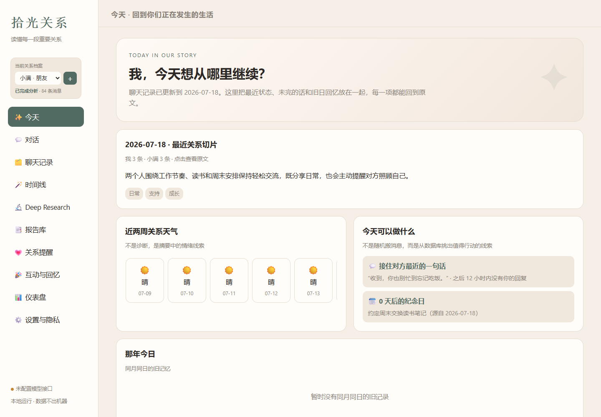
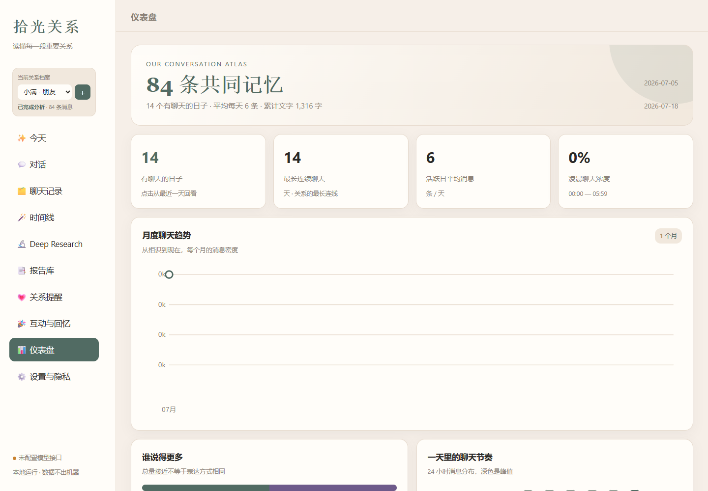
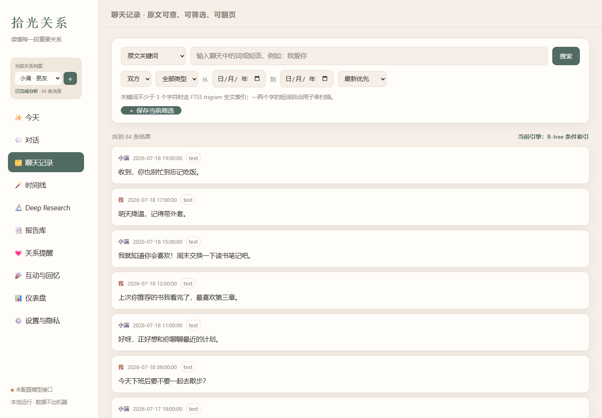
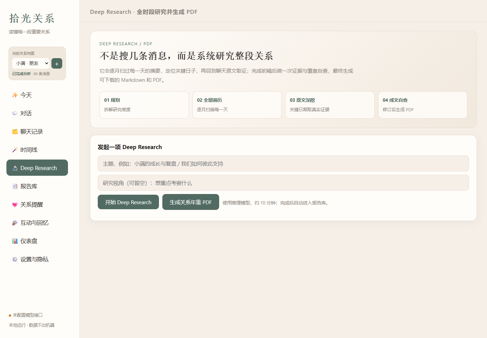
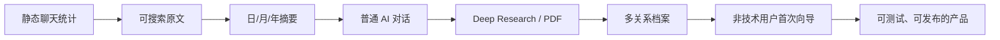
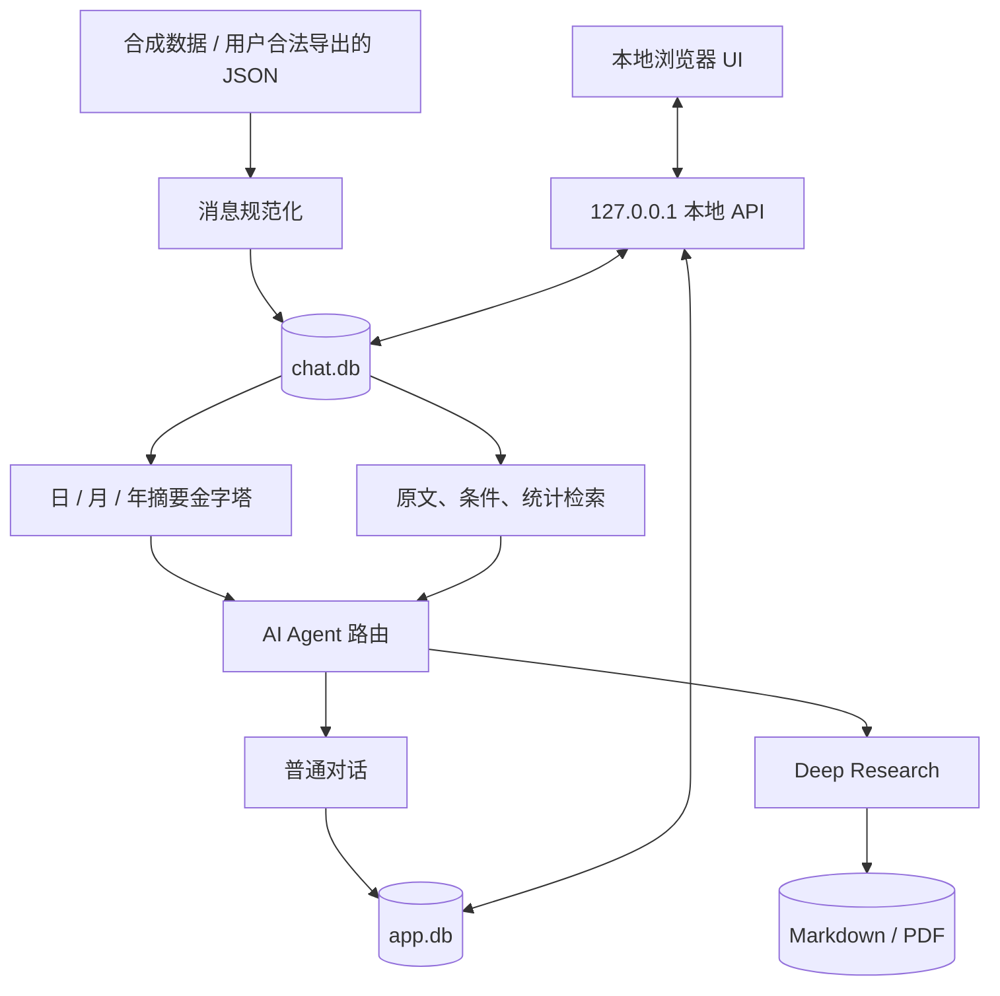

# 拾光 Shiguang

> 本地优先的 AI 关系洞察产品：让长期聊天从“存着”变成“可搜索、可追溯、可研究的共同记忆”。

[](https://github.com/juzi1234566/shiguang-ai-relationship-insight/actions/workflows/ci.yml)


**我的角色：产品经理 / AI-assisted builder**  
我从真实用户问题出发，完成需求定义、产品结构、AI 检索策略、隐私边界、交互迭代、验收指标和发布流程，并借助 AI 编程工具把产品做成可运行的 Windows 本地应用。

> 公开仓库只包含合成演示数据和经过脱敏的核心源码；[Releases](https://github.com/juzi1234566/shiguang-ai-relationship-insight/releases) 另提供可直接运行的 Windows 安装包（关系版 / 情侣版）。真实聊天、数据库、报告、API Key 和原生密钥恢复的**源代码**不公开。

## 面试官 5 分钟导览

1. **先看产品结果**：下面的合成数据演示截图。
2. **再看我如何做产品**：[完整产品案例](docs/product-case-study.md)。
3. **看取舍而不只看功能**：[关键产品决策](docs/product-decisions.md)。
4. **看我如何从错误中迭代**：[研发与复盘日志](docs/iteration-log.md)。
5. **看系统如何落地**：[AI 与数据架构](docs/architecture.md)。

更短的面试讲解脚本见 [Interview Tour](docs/interview-tour.md)。

## 下载即用（Windows）

想直接分析自己的聊天、而不只是看演示，可到 [Releases](https://github.com/juzi1234566/shiguang-ai-relationship-insight/releases) 下载单文件安装包：

- **拾光关系版** —— 分析和任意重要的人（朋友、家人、同事）的聊天。
- **拾光情侣版** —— 面向情侣关系的默认模板与文案。

下载后双击即可，首次打开按向导操作。使用须知：

- **仅用于分析你自己的、或对方知情同意的聊天记录**，请勿用于未经授权访问他人数据。
- 全程在你本机运行，聊天数据不上传服务器；AI 分析需你自己填入模型 API Key。
- 需要电脑版微信 **4.0 及以上**，保持打开并登录。
- 程序会在本机读取微信内存以恢复本地数据库密钥，且未做代码签名，**360／火绒／Windows SmartScreen 可能报警**——请在安全软件里对它放行 / 信任。
- 只想快速看效果、无需安装，可跑合成数据演示（见下方“公开演示：3 分钟运行”）。

## 产品展示

### 今天：把数据变成下一步行动



### 仪表盘：描述关系节奏，而不是堆图表



<details>
<summary>查看更多界面</summary>

#### 多种搜索路径



#### Deep Research：全时段研究与 PDF



</details>

所有截图都来自 `scripts/create_demo.py` 生成的虚构档案“小满”，不对应任何真实人物。

## 我解决了什么问题

现代人的聊天记录越来越多，但回顾越来越少。普通聊天搜索只能回答“某句话在哪里”，无法回答：

- 我们最近反复在聊什么？
- 一段关系的情绪和主题如何变化？
- 某个判断有哪些原文证据？
- 能否把几个月甚至一年的互动整理成一份可保存的报告？

拾光把这些问题拆成不同成本和可靠性的检索路径，而不是把全部聊天直接塞给大模型。

| 用户问题 | 产品选择 | 为什么 |
|---|---|---|
| 普通交流、建议 | 直接对话 | 不需要假装查库 |
| 模糊事件、关系变化 | 日/月/年摘要定位 | 低成本覆盖全时段 |
| 找真实原话 | FTS / 精确短语检索 | 返回日期、发送者和上下文 |
| 数量、频率、排行 | 只读 SQL | 统计问题不让模型猜 |
| 完整关系研究 | Deep Research + PDF | 全量遍历、原文取证、报告自查 |

## 已验证的结果

- 在私有生产环境中验证过 **10 万+** 消息规模，不把整库一次性塞进上下文。
- 建立 **日 → 月 → 年摘要金字塔**，支持长期趋势与原文证据之间双向下钻。
- 普通 AI 对话、用户纠正、置顶记忆、报告任务和设置均持久化。
- 每个联系人使用独立关系档案、聊天库、AI 会话、报告目录和密钥配置。
- 生产工程累计 **63 项自动化回归测试**；公开版保留无私人数据的核心测试与 CI。
- 发布为通用关系版与情侣版单文件 EXE，并解决真实导入、进度、浏览器生命周期和新旧构建并存问题。

## 一条产品主线



这条主线背后的关键变化是：从“做出一个有趣分析”转向“让没有技术背景的人能够安全、持续地使用”。

## 三个最重要的产品判断

### 1. 本地优先不是一句口号

聊天库、AI 会话、报告和密钥配置默认留在用户电脑。模型只接收完成当前任务所需的最小上下文；用户还能设置日期或关键词排除范围。

### 2. 检索策略属于产品设计

拾光不是只有一个“向量搜索”。它根据问题选择原文、摘要、结构化统计或深度研究，并在回答需要证据时回到原文。这让答案的成本、速度和可信度都可解释。

### 3. 失败体验必须被设计

真实用户说“卡退”，根因不一定是性能。一次实测中，真正问题是联系人没有消息表，后端快速失败后页面又自动跳走。修复不是“加加载动画”，而是提前过滤不可导入联系人、显示真实进度、保留错误和重试入口。

更多判断见 [产品决策记录](docs/product-decisions.md)。

## 公开演示：3 分钟运行

要求：Python 3.11+。

### Windows PowerShell

```powershell
python -m venv .venv
.\.venv\Scripts\Activate.ps1
pip install -r requirements.txt
.\scripts\run_demo.ps1
```

### macOS / Linux

```bash
python3 -m venv .venv
source .venv/bin/activate
pip install -r requirements.txt
bash scripts/run_demo.sh
```

浏览器打开 `http://127.0.0.1:18999`。演示会创建 84 条合成消息、14 天摘要和一段合成 AI 会话。

也可以在首次向导中导入 [合成 JSON 示例](sample_data/synthetic_chat.json)。

## 系统结构



完整说明见 [架构文档](docs/architecture.md)。

## 目录

```text
app/ui/                 本地网页界面
scripts/server.py       本地 API 与 AI 工具路由
scripts/chatdb.py       原文、摘要和统计检索
scripts/appdb.py        AI 会话、设置、任务与用户反馈
scripts/create_demo.py  生成完全合成的演示环境
scripts/wechat_native.py 公开版数据源接口占位
tests/                  无私人数据的自动化测试
docs/                   产品案例、决策、架构与复盘
assets/screenshots/     合成数据实机截图
```

## 公开范围与伦理边界

公开仓库不包含 Windows 原生聊天密钥恢复的**源代码**。原因不是“没有做完”，而是：

1. 它依赖特定版本第三方客户端的内部实现，随版本变化，不适合作为通用开源组件；
2. 公开**源码**会降低误用与二次改造门槛，带来授权、平台条款和滥用风险；
3. 作品集的重点是产品判断与系统能力，而不是提供一份可改造的数据提取实现。

为了让真实用户能真正用上产品，[Releases](https://github.com/juzi1234566/shiguang-ai-relationship-insight/releases) 提供已编译的关系版 / 情侣版安装包：它只在用户**本机**、针对**本人或对方知情同意**的聊天做本地分析，不上传任何数据，请勿用于未经授权访问他人数据。公开仓库同时保留 JSON 数据源接口、合成数据、全部产品层和本地数据架构。详细边界见 [Privacy & Security](docs/privacy-and-security.md)。

## 技术栈

- Python 3.11、SQLite / FTS5
- 原生 HTML / CSS / JavaScript
- OpenAI-compatible LLM API
- ReportLab / pypdf
- PyInstaller（私有生产构建）
- unittest、GitHub Actions、Playwright CLI

## Roadmap

- 脱敏诊断页：一键导出不含正文、密钥和绝对路径的故障信息
- 可取消后台任务与更明确的超时说明
- 增量导入与稳定消息去重
- 关系洞察评估集：证据召回、事实一致性、用户纠正采纳率
- 经授权的数据连接器规范

详见 [Roadmap](docs/roadmap.md)。

## License

代码使用 [MIT License](LICENSE)。合成截图与产品文档可用于作品集评审；请勿把本项目用于未经授权的数据访问。
