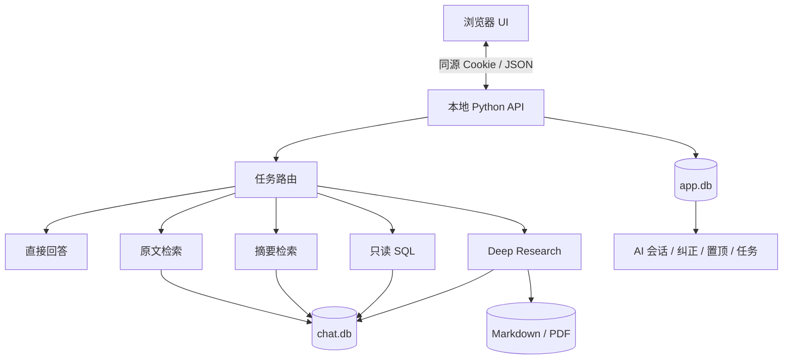
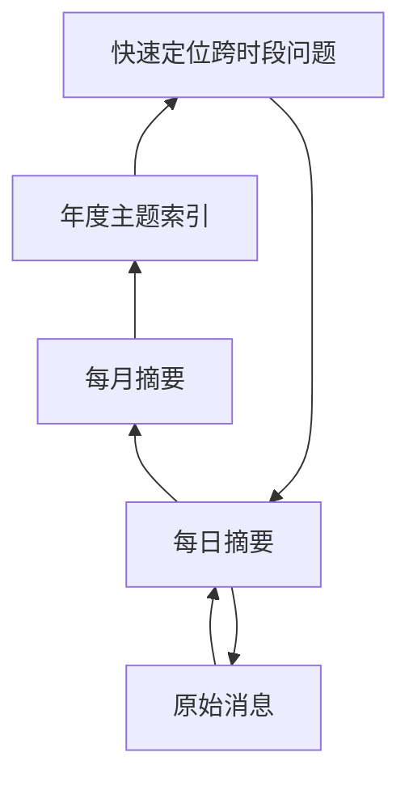

# AI 与数据架构

## 1. 总体结构



## 2. 为什么有两个数据库

`chat.db` 保存导入消息与摘要，它是关系事实层；`app.db` 保存用户与拾光共同产生的状态，包括 AI 对话、纠正、置顶、未来信和报告任务。

分开以后：

- 重新导入聊天时不会覆盖 AI 会话；
- 原始事实与模型生成内容不会混表；
- 每个联系人可以拥有独立的事实层和应用状态层。

## 3. 摘要金字塔



查询从高层定位，回答需要证据时再向下回到原文。这比“只存一个压缩总结”更能保留可追溯性。

## 4. 五种任务路径

| 路径 | 数据范围 | 优点 | 主要风险 |
|---|---|---|---|
| 直接回答 | 不读历史 | 快、便宜 | 不能假装看过记录 |
| 原文检索 | 消息表 | 证据准确 | 关键词可能漏召回 |
| 摘要检索 | 日/月/年 | 覆盖长期变化 | 摘要不能冒充原话 |
| 只读 SQL | 结构化字段 | 数量可靠 | 必须严格限制为 SELECT |
| Deep Research | 全摘要 + 重点原文 | 系统完整 | 耗时，需要任务状态与自查 |

## 5. 本地 HTTP 安全

- 只监听 `127.0.0.1`；
- 每次启动生成独立会话 Cookie；
- 校验 Host、Origin 与同源端口；
- 请求体限制为 2 MiB，并设置读取超时；
- 本地服务使用独占端口，避免新旧构建共享地址；
- API Key 只在后端读取，不进入前端 HTML。

## 6. 档案隔离

注册表只保存称呼、关系类型、状态和数据根路径。每个联系人目录独立包含：

```text
profiles/<profile-id>/
├─ data/clean/chat.db
├─ data/clean/app.db
├─ config/
├─ reports/
├─ work/
└─ logs/
```

生产版在切换档案后重启本地进程，使所有模块重新绑定到新的数据根，避免旧全局连接串库。

## 7. 公开版数据源接口

`scripts/wechat_native.py` 在公开仓库中是明确的接口占位。产品层只依赖 `status / prepare / list_contacts / fetch_contact_messages`，因此可以接入经授权的数据源，而无需修改搜索、AI 和报告层。

公开演示使用 `scripts/create_demo.py` 或用户自己的 JSON。私有生产适配器不在本仓库中。
